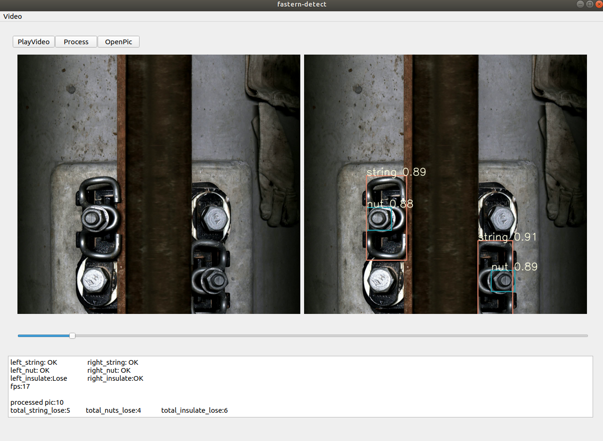

# Railway-Fasterner Detection based on YOLOv5

Use yolov5 and hsv tracking to detect defect in railway fasterner

## Environment:
CPU Intel(R) Core(TM) i5-9300H
Ubuntu 18.06LTS
OpenCV 4.2.0.34 

## Code structure
- imgProc.py: contains various image process method, such as colorspace tracking, hough line detection and so on.
- pic2vid.py: transform pictures to video
- detectCore.py: process Yolo's bounding boxes and detect insulate
- detectApp.py: UI window based on pyqt5

## Demo:
Demo picture

see demo.mp4
